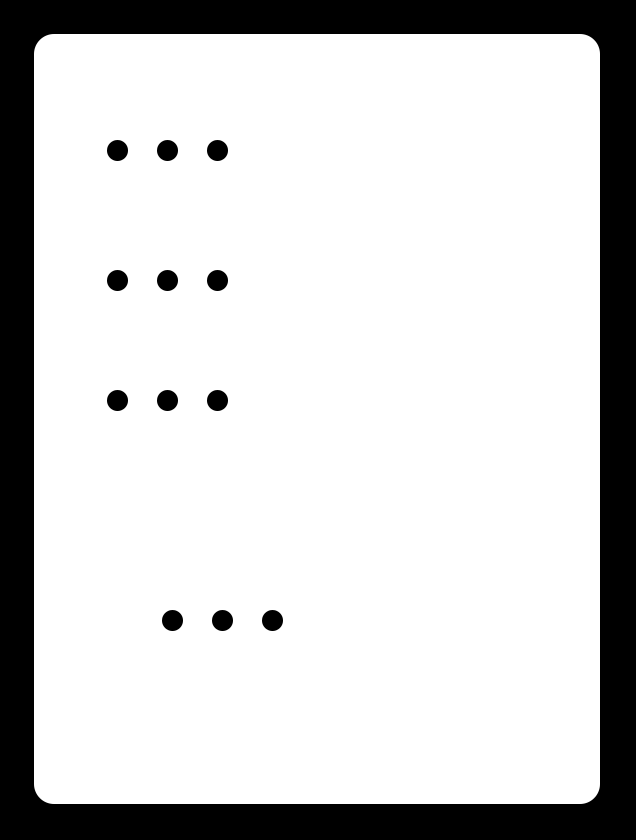

# Beeshield

## Sensors

This 'shield' connects the following sensors to the Smart Citizen base kit - [input pin wiki page](https://github.com/fablabbcn/Smart-Citizen-Kit/wiki/Making-a-Shield)

* 1 x DHT22 Temperature and Humidity Sensor
* 3+ x DS18B20 Digital Temperature Sensors

The three inputs for the DS18B20 aren't actually necessary, although the board works perfectly fine using them as-is, you can daisy-chain loads of these sensors together meaning that they only require a single input pin. They are a relic from using previous sensors and time constraints meant that they stayed as 3 pins.

The DHT22 is a strange beast. There are different versions of it. Some will happily run at 3.3V, the ones that I encountered will only run at 5V, however, there is a 'hack'. If you flagrantly ignore the following datasheet diagram

 and connect pin 3 to ground, along with pin 4, it seems to work. Keep in mind that this is a very slow sensor, I wouldn't recommend taking readings from it any faster than once every few seconds.
 
## Connections

You may notice that 2 of the last pins on the 12 pin connection aren't actually connected to anything, it's just that there are 6 pins on each header. By all means use 10 pins instead.

## Milling

I haven't tested the circuit PNGs above and my memory is a bit rusty. Please check that the borders are ok and that they are a reasonable size (in mm) in Fab Modules before milling.

## Misc

Feel free to ignore the `misc` folder, I was just dumping related stuff in there.

### Other Information

You may? find some insights here although I was quite delirious from lack of sleep when the page was written!
[http://academy.cba.mit.edu/2013/students/rees.john/input-devices/](http://academy.cba.mit.edu/2013/students/rees.john/input-devices/)